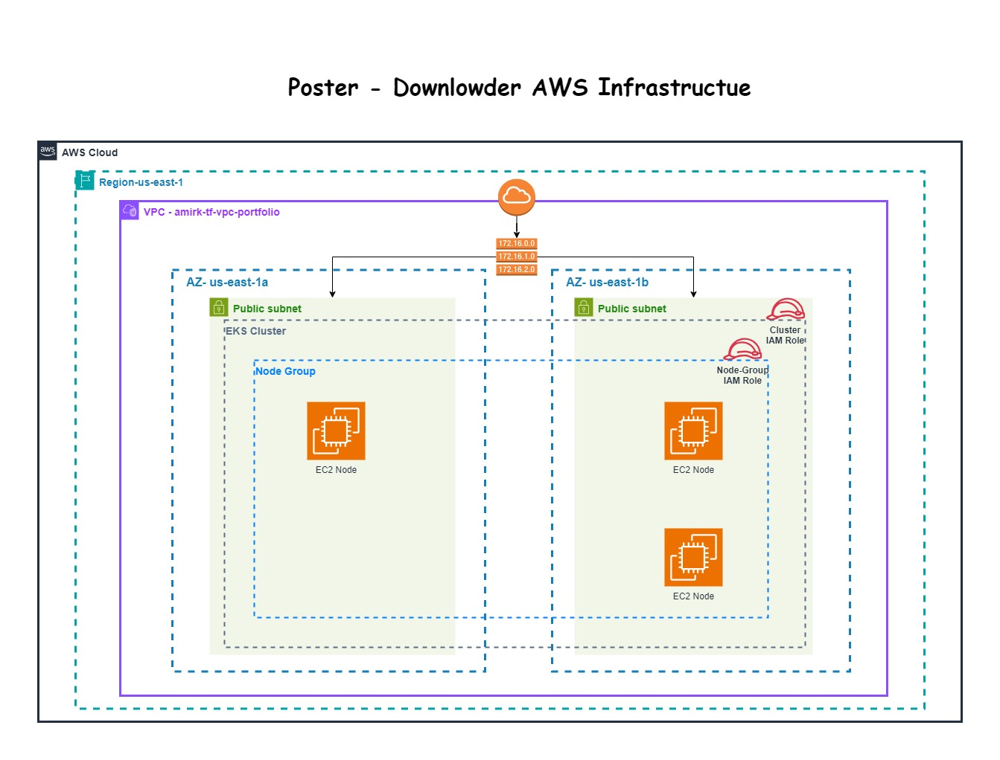

# Terraform AWS Infrastructure

## Architecture

# ⚠️ Cost Warning
Running the infrastructure set up by this Terraform project may incur expenses in your AWS account. 
AWS charges for the resources and services used, such as EC2 instances, data transfer, and the Application Load Balancer. 
Before applying the Terraform configurations, ensure you understand the costs associated with each resource and that you monitor usage to avoid any unexpected charges. 
Always remember to destroy resources you no longer need using `terraform destroy` to prevent ongoing charges.